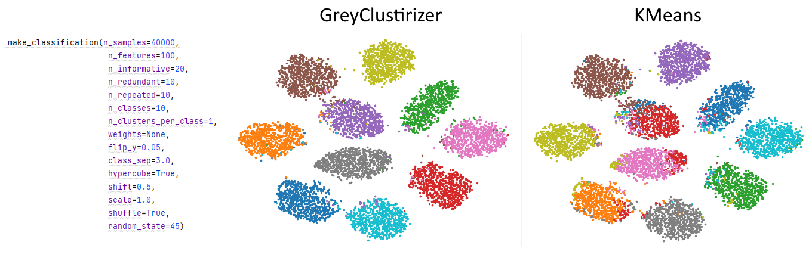

# grey-clusterizer
Adaptation of contrastive clustering approach (see citation) for tabular (1D) data based on deep neural networks.

# Pros:
*) The ability to work on really big data (millions of samples)\
*) The ability to work on vectors of large dimensions (even >=1000)\
*) The possibility of using on new samples that the clusterizer has not yet seen (for example, good clusterers like AgglomerativeClustering, DBSCAN, OPTICS, SpectralClustering are not capable of this)\
*) Accounting for nonlinear relationships between features\
*) Huge speed even when training on the CPU\
*) Resistance to noise, outliers (under certain parameters)\
*) Flexibility (availability of a large number of parameters that can be configured for a specific dataset)\
*) Availability of a version for hierarchical clustering\
*) The hierarchical version has the ability to optimize memory consumption (caching or unloading into RAM). On big data, with large vectors, a large number of clusters, error gradients consume a lot of GPU memory, which requires the possibility of either caching or unloading trained models into RAM. In addition, multiple levels of clusters require the creation of multiple models.\
*) Easy to use

# Cons:
*) The more clusters, the more memory is required for training (Try using a hierarchical version with fewer clusters to neatly work around this problem if it occurs).\
*) On a specific dataset, you may have to tune the parameters to get optimal results\
*) There may be strange results with some parameters\
*) Problems of reproducibility of experiments (the results are slightly different each time with the same settings)

# Future plans:
*) Add the ability to automatically determine the optimal number of clusters

# Comparison
Comparing results on a synthetic classification dataset with close to practice settings (with noise, multicollinear and repeatable features).


# Install
By default CPU PyTorch will be installed. 
If you need GPU follow the PyTorch documentation to install GPU version of PyTorch.
```
git clone https://github.com/CameleoGrey/grey-clusterizer.git
conda create -n grey-clusterizer python=3.9
conda activate grey-clusterizer
pip install -r requirements.txt
```

# Citation
@inproceedings{li2021contrastive,
  title={Contrastive clustering},
  author={Li, Yunfan and Hu, Peng and Liu, Zitao and Peng, Dezhong and Zhou, Joey Tianyi and Peng, Xi},
  booktitle={Proceedings of the AAAI Conference on Artificial Intelligence},
  volume={35},
  number={10},
  pages={8547--8555},
  year={2021}
}
